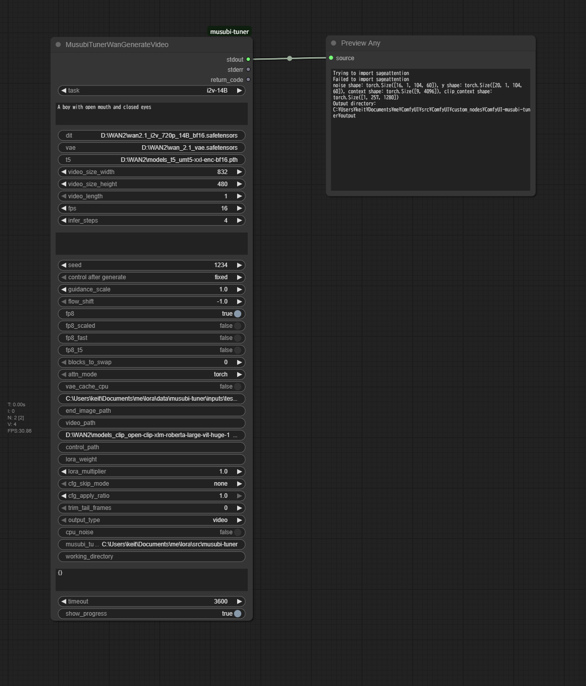

# ComfyUI-musubi-tuner

ComfyUIからmusubi-tunerを実行できるようにするカスタムノードです。

## 前提条件

- [musubi-tuner](https://github.com/kohya-ss/musubi-tuner) がインストールされていること

## セットアップ

`ComfyUI/custom_nodes` へリポジトリをクローンしてください。
```bash
git clone https://github.com/keit0728/ComfyUI-musubi-tuner.git
```

## 対応機能

### Wan2.1での動画生成


